# 🚀 End-to-End Azure Data Engineering Project

**Medallion Architecture ETL Pipeline** | Azure Data Factory → Databricks (Delta Lake) → Unity Catalog → Synapse Serverless SQL


---

## 📌 Overview

This project implements a production-style, end-to-end data engineering pipeline on Azure, following the **Medallion Architecture** (Bronze → Silver → Gold). It ingests the **AdventureWorks** dataset from an on-premises/Azure SQL source, orchestrates the pipeline using **Azure Data Factory**, processes and cleans data using **PySpark on Azure Databricks**, stores it as versioned **Delta Lake** tables governed by **Unity Catalog**, and exposes curated, analytics-ready data through **Azure Synapse Serverless SQL Pools**.

The goal was to replicate how a real organization would move data from a transactional source system into a governed, query-ready analytics layer — with reliability, schema management, and access control built in rather than bolted on.

---

## 🏗️ Architecture

```mermaid
flowchart LR
    A[On-Prem / Azure SQL<br/>AdventureWorks DB] -->|Self-Hosted<br/>Integration Runtime| B[Azure Data Factory<br/>Orchestration]
    B --> C[(ADLS Gen2<br/>Bronze Layer<br/>Raw)]
    C --> D[Azure Databricks<br/>PySpark Transformations]
    D --> E[(ADLS Gen2<br/>Silver Layer<br/>Cleaned / Delta)]
    E --> F[Azure Databricks<br/>Business Logic + Aggregations]
    F --> G[(ADLS Gen2<br/>Gold Layer<br/>Curated / Delta)]
    G --> H[Unity Catalog<br/>Governance & Access Control]
    H --> I[Azure Synapse<br/>Serverless SQL Pool]
    I --> J[Power BI / Reporting]
```



**Data flow:**
1. **Ingestion** — ADF pipelines pull AdventureWorks tables from the source SQL database using a Self-Hosted Integration Runtime, landing raw data in the ADLS Gen2 **Bronze** container.
2. **Transformation** — Databricks notebooks (PySpark) clean, deduplicate, and standardize the Bronze data into the **Silver** layer as Delta tables.
3. **Aggregation** — Further Databricks notebooks apply business logic and aggregations to produce **Gold**-layer, analytics-ready Delta tables.
4. **Governance** — Unity Catalog manages schema, access control, and lineage across all layers.
5. **Consumption** — Synapse Serverless SQL Pools expose the Gold layer via external tables/views for querying and BI reporting.
6. **Orchestration & Scheduling** — ADF triggers automate the end-to-end pipeline run.

---

## 🧰 Tech Stack

| Layer            | Tool/Service                          |
|-------------------|----------------------------------------|
| Orchestration      | Azure Data Factory                     |
| Storage            | Azure Data Lake Storage Gen2 (Medallion: Bronze/Silver/Gold) |
| Transformation      | Azure Databricks, PySpark              |
| Table Format        | Delta Lake                             |
| Governance          | Unity Catalog                          |
| Serving/Query Layer  | Azure Synapse Serverless SQL Pool     |
| Source System        | Azure SQL / On-Prem SQL Server (AdventureWorks) |

---

## 📂 Repository Structure

```
├── dataset/               # ADF dataset definitions (source & sink schemas)
├── factory/                # ADF factory-level configuration
├── integrationRuntime/     # Self-hosted IR config for on-prem connectivity
├── linkedService/          # Connections to SQL source, ADLS Gen2, Databricks
├── pipeline/                # ADF pipeline JSON definitions (ingestion & orchestration)
├── trigger/                 # Scheduled/event-based pipeline triggers
├── notebooks/                # PySpark notebooks: Bronze → Silver → Gold transformations
├── sql/                      # Synapse Serverless SQL views/external tables
├── docs/                      # Architecture diagram & screenshots
└── publish_config.json        # ADF publish/deployment metadata
```

> Note: The `factory/`, `pipeline/`, `linkedService/`, `dataset/`, `trigger/`, and `integrationRuntime/` folders are auto-generated by Azure Data Factory's Git integration and represent the orchestration layer of the pipeline (built via ADF's visual authoring canvas).

---

## ✨ Key Highlights

- Implemented a **3-tier Medallion Architecture** (Bronze/Silver/Gold) for progressive data refinement
- Automated ingestion from an on-prem SQL source using **Self-Hosted Integration Runtime**
- Used **Delta Lake** for ACID transactions, schema enforcement, and time travel on all curated layers
- Applied **Unity Catalog** for centralized governance and fine-grained access control
- Exposed curated data via **Synapse Serverless SQL** — no dedicated compute cost, pay-per-query
- Fully parameterized, reusable ADF pipelines for scalable ingestion

---

## ⚙️ How to Reproduce

1. Provision Azure resources: ADLS Gen2, Data Factory, Databricks workspace, Synapse workspace
2. Restore the AdventureWorks database and configure a Self-Hosted Integration Runtime
3. Import ADF pipelines/datasets/linked services from this repo (`ARM Template` / Git integration)
4. Run notebooks in `notebooks/` sequentially in Databricks (Bronze → Silver → Gold)
5. Create external tables/views in Synapse Serverless SQL using scripts in `sql/`
6. Trigger the ADF pipeline manually or via the configured trigger

---

## 🎯 Skills Demonstrated

`Data Pipeline Orchestration` `Medallion Architecture` `PySpark` `Delta Lake` `Data Governance` `Incremental/Batch Ingestion` `SQL` `Cloud Data Warehousing` `ETL/ELT Design`

---

## 👤 Author

**Nikhil Manne** — Data Engineer
[LinkedIn](#) • [GitHub](https://github.com/nikhilmanne10)
